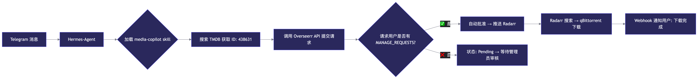

# 🎬 Media Copilot - 全自动媒体下载助手
通过 Hermes Channels 接收消息，自动调用 Overseerr/Radarr/Sonarr/qBittorrent/Prowlarr 实现电影电视剧的智能搜索与下载

<p align="center">
  
</p>


## 🎯 何时使用此技能

当用户通过 Hermes Channels 发送以下类型的消息时，自动加载本技能：
- "下载电影《奥本海默》" / "add movie Oppenheimer"
- "追剧《权力的游戏》" / "subscribe to Game of Thrones"
- "搜索 4K 版本的《沙丘2》" / "search Dune Part Two 4K"
- "查看下载队列" / "check download queue"
- "暂停所有下载" / "pause all downloads"
    
## ⚡ 快速参考

| 操作 | Overseerr API | Radarr API [[29]] | Sonarr API | qBittorrent API [[52]] |
|------|--------------|-------------------|------------|------------------------|
| 搜索电影 | `GET /api/v1/search` | `GET /api/v3/movie/lookup` | - | - |
| 添加电影 | `POST /api/v1/request` | `POST /api/v3/movie` | - | - |
| 搜索剧集 | `GET /api/v1/search` | - | `GET /api/v3/series/lookup` | - |
| 添加剧集 | `POST /api/v1/request` | - | `POST /api/v3/series` | - |
| 查看队列 | - | `GET /api/v3/queue` | `GET /api/v3/queue` | `GET /api/v2/torrents/info` |
| 暂停下载 | - | - | - | `POST /api/v2/torrents/pause` |
| 手动搜索 | - | `POST /api/v3/command` (name: `MoviesSearch`) | `POST /api/v3/command` (name: `SeriesSearch`) | `POST /api/v2/torrents/reannounce` |

### 🔐 认证方式

所有 API 均使用 **Header 认证**：
```http
# Radarr/Sonarr/Prowlarr
X-Api-Key: YOUR_API_KEY

# Overseerr
X-Api-Key: YOUR_OVERSEERR_API_KEY

# qBittorrent (先登录获取 Cookie)
POST /api/v2/auth/login
Cookie: SID=xxx
